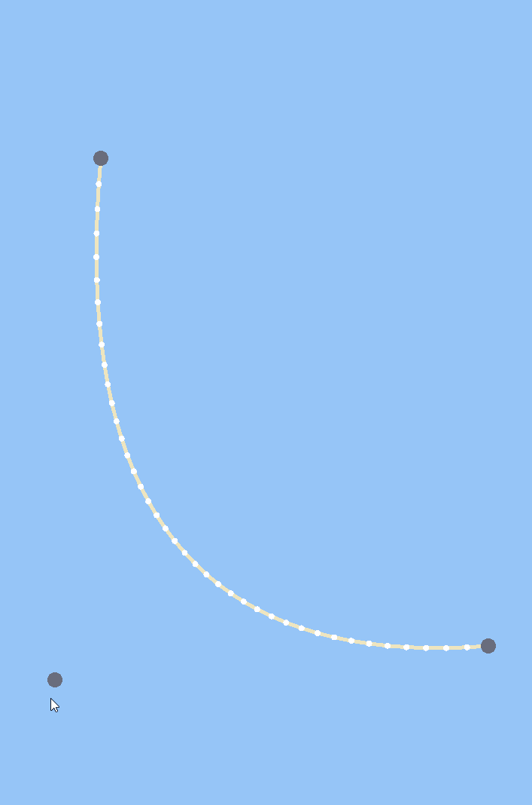

# Quadratic Bezier Curve Application

This is a C++ project that utilizes the SFML library to create a simple application for manipulating quadratic Bezier curves. The application allows users to interactively control the shape of the curve by dragging control points and adjust the level of detail by scrolling up or down.

  

## Features

- **Quadratic Bezier Curve:** The application focuses on quadratic Bezier curves, which are defined by three control points - a start point, a control point, and an end point. These curves are widely used in computer graphics and animation.

- **Draggable Control Points:** Users can click and drag the control points of the quadratic Bezier curve to dynamically change its shape. This feature enables intuitive manipulation of the curve and provides real-time visual feedback.

- **Scroll Up/Down for Level of Detail:** By scrolling up or down, users can increase or decrease the number of line segments used to approximate the curve. This allows for adjusting the level of detail and smoothness of the curve, providing control over its visual appearance.

## Dependencies

To compile and run this application, you need to have the following dependencies:

- **SFML Library:** The project utilizes the SFML library (Simple and Fast Multimedia Library) to handle window creation, event handling, and rendering. Make sure you have SFML properly installed on your system.

## Usage

1. Clone or download the project repository to your local machine.

2. Open the project in your preferred C++ development environment.

3. Make sure you have properly set up the SFML library with your project.

4. Build and compile the project.

5. Run the compiled executable.

6. The application window will open, displaying the initial quadratic Bezier curve with control points.

7. Click and drag the control points to manipulate the shape of the curve.

8. Scroll up or down to increase or decrease the level of detail (number of line segments) used to approximate the curve.

9. Explore different configurations and enjoy interacting with the quadratic Bezier curve.

## Contributing

Contributions to this project are welcome! If you find any bugs, have suggestions for improvements, or want to add new features, feel free to open an issue or submit a pull request. Please make sure to follow the project's code of conduct.

## License

This project is licensed under the [MIT License](LICENSE). Feel free to use, modify, and distribute the code for personal or commercial purposes. However, please provide appropriate attribution to the original author.
